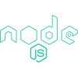
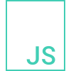
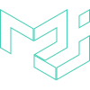

<!-- Greeting -->

## Hello there!

I am Nicolás Hernán Silva, aka Koppeks, Fullstack web developer and UX/UI designer.

<!--Introduction -->
## 🧑🏽 About Me

 

<!-- - 🔧 I’m currently working on ...Online Retail Community App. -->

- 🌟 I’m curious about ... the universe, nature and AI
- 📖 I’m currently learning ... Python.
- 📫 How to reach me ... koppeks.contactos@gmail.com.

 📡 Connect with me 📱

### My skills include

	
	
	
	
	
	
	
	
	
	
	
	

### Tools

